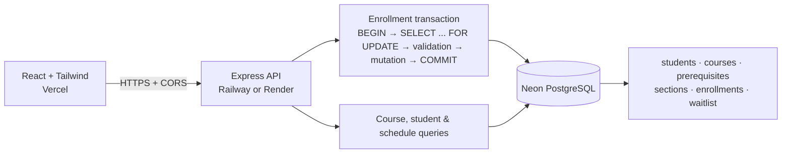

# University Course Registration Engine

A full-stack course-registration application built with Express, React, Tailwind CSS, and PostgreSQL. It uses raw `pg` SQL only—there is no ORM, mock store, SQLite database, or JavaScript mutex.

## Architecture



The browser only renders API data. The Express API owns the domain rules. PostgreSQL owns the concurrency control: an enrollment takes a `SELECT * FROM sections WHERE id = $1 FOR UPDATE` lock before reading or changing seat inventory. A student row is also locked to prevent parallel registrations into different sections from bypassing the 20-credit cap.

## Included functionality

- `POST /api/enroll`: PostgreSQL transaction, section row lock, prerequisite validation, 20-credit cap validation, time-overlap validation, seat decrement, and credit update.
- `DELETE /api/enroll`: transactional drop that restores a seat and promotes the first waitlisted student atomically.
- `GET /api/courses`: courses with sections and current inventory.
- `GET /api/students` and `POST /api/students`: selector data and student creation.
- `GET /api/students/:id/schedule`: current enrolled sections.
- 10 courses, 22 sections, four prerequisite relationships, and five seeded students.

## Local setup

Prerequisites: Node.js 18+ and PostgreSQL 14+ with `psql` available on your path.

1. Create a PostgreSQL database, for example `course_registration`.
2. Copy the environment template and replace its connection value:

   ```powershell
   Copy-Item .env.example .env
   ```

   Set `DATABASE_URL` in `.env`. It is never hard-coded in application code.

3. Install both applications:

   ```powershell
   npm install
   npm run install:all
   ```

4. Create the database schema and seed it:

   ```powershell
   npm --prefix backend run db:schema
   npm --prefix backend run db:seed
   ```

5. Start both services:

   ```powershell
   npm run dev
   ```

   Open `http://localhost:5173`. The API runs on `http://localhost:4000`; CORS permits the configured `CLIENT_ORIGIN`.

## Enrollment transaction

`POST /api/enroll` does the following on one checked-out PostgreSQL connection:

1. `BEGIN`
2. Read the requested section with `SELECT ... FOR UPDATE OF s`.
3. Reject full sections with `409 SECTION_FULL`, lock the student row, and reject duplicate enrollments.
4. Check completed prerequisite records (`enrollments.status = 'completed'`).
5. Check `credits_enrolled + course.credits <= 20`.
6. Check same-semester, same-day interval overlap with `NOT (new_end <= existing_start OR new_start >= existing_end)`.
7. Decrement the section's inventory, insert the enrollment, and increment student credits.
8. `COMMIT`; any error performs `ROLLBACK` and yields a clear HTTP error.

The lock must remain in this flow. The entire transaction is database-backed; there is no process-local locking mechanism.

## Concurrency Proof

`load-test.js` creates an isolated, brand-new 10-seat section plus 50 unique students, then fires all 50 `POST /api/enroll` calls at the same time with `Promise.all`. It queries PostgreSQL afterwards and asserts both:

- enrolled count is never greater than `seats_total`; and
- `seats_available === seats_total - enrolled_count`.

With the normal (safe) server running, execute:

```powershell
node load-test.js
```

Expected result: exactly **10** HTTP `201` enrollments, **40** HTTP `409` full-section responses, `seats_available: 0`, and `PASS`. The section row lock serializes competing requests, proving that inventory cannot be oversold.

## API examples

```http
POST /api/enroll
Content-Type: application/json

{ "studentId": "<uuid>", "sectionId": "<uuid>" }
```

```http
DELETE /api/enroll
Content-Type: application/json

{ "studentId": "<uuid>", "sectionId": "<uuid>" }
```

Possible enrollment responses include `PREREQUISITES_NOT_MET`, `CREDIT_CAP_EXCEEDED`, `SCHEDULE_CONFLICT`, `ALREADY_ENROLLED`, and `SECTION_FULL` when inventory is zero.

## Deployment

### 1. Create a Neon database

1. Create a Neon project and copy its pooled PostgreSQL connection string.
2. In the repository root, set `DATABASE_URL` to that connection string and run the schema and seed commands once:

   ```powershell
   npm.cmd --prefix backend run db:schema
   npm.cmd --prefix backend run db:seed
   ```

Neon connection strings use TLS. The backend detects `sslmode=require` and configures `pg` for the Neon connection.

### 2. Deploy the API to Railway or Render

Choose one API host.

**Railway**

1. Create a project from this Git repository and set its root directory to `backend`.
2. Set `DATABASE_URL` to the Neon connection string.
3. Set `CLIENT_ORIGIN` to your future Vercel URL (for example, `https://your-app.vercel.app`).
4. Railway runs `npm start`; its assigned `PORT` is consumed by `backend/server.js`.

**Render**

1. Create a Blueprint from this repository. [render.yaml](render.yaml) defines the API service with `backend` as its root directory.
2. Enter `DATABASE_URL` and `CLIENT_ORIGIN` as environment variables when Render requests them.
3. Verify the deployed health endpoint at `https://<render-service>/api/health`.

### 3. Deploy the frontend to Vercel

1. Import this Git repository into Vercel and set its root directory to `frontend`.
2. Add an environment variable named `VITE_API_URL` with the deployed backend URL plus `/api`, such as `https://your-api.up.railway.app/api`.
3. Deploy. Vercel detects the Vite project; [frontend/vercel.json](frontend/vercel.json) supplies the single-page app rewrite.
4. Copy the final Vercel URL into the API host's `CLIENT_ORIGIN` setting and redeploy the API if necessary.

Never place the Neon connection string in a Vercel environment variable—only the backend needs it.
